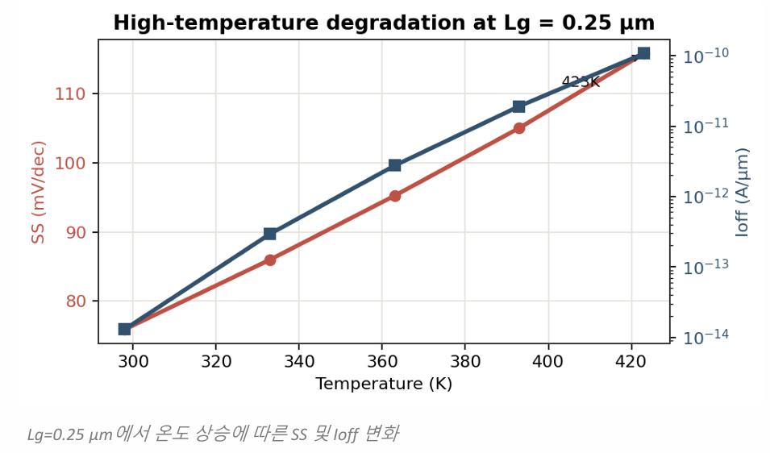
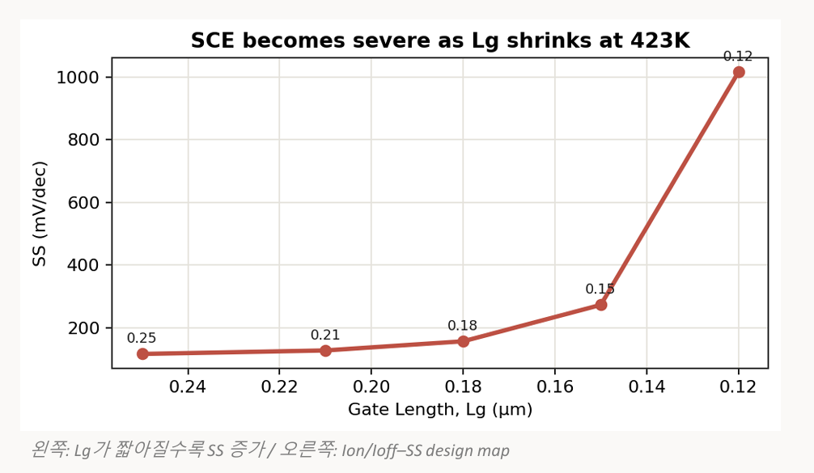
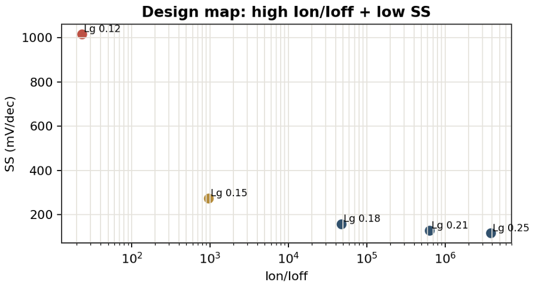
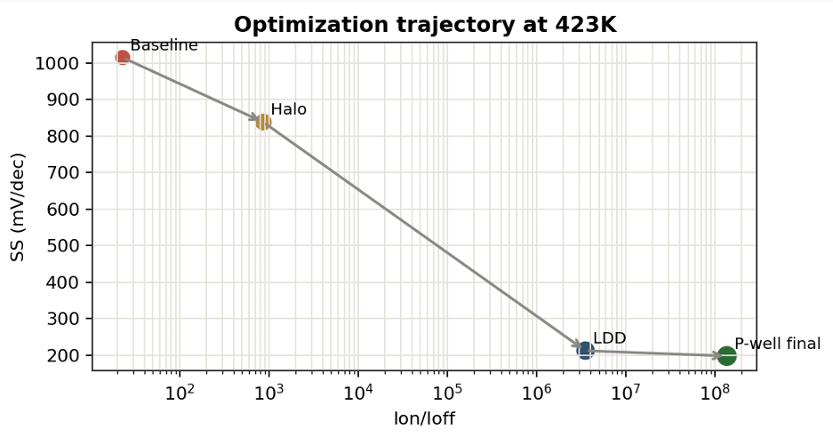
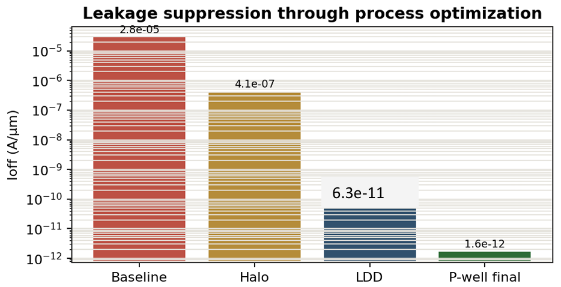
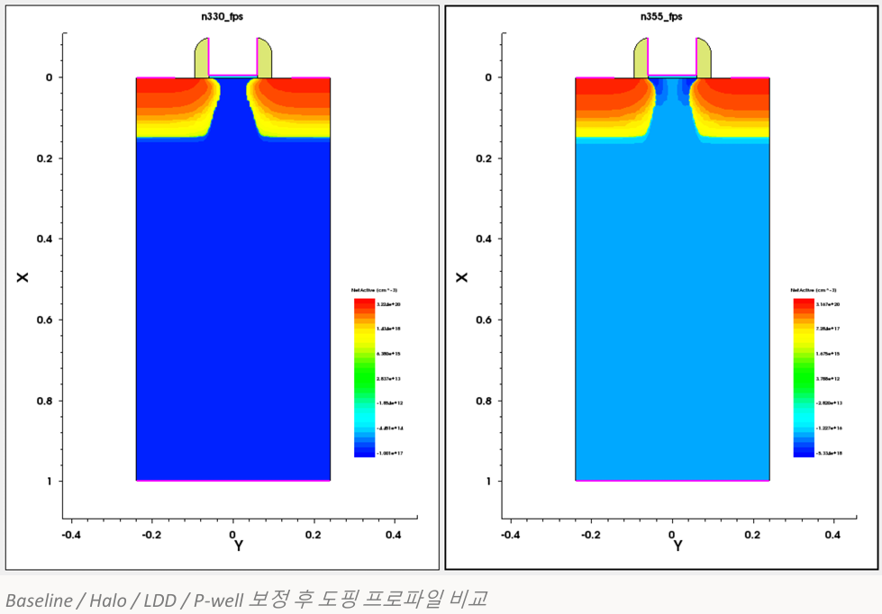

# Automotive NMOS Optimization (TCAD)

### Overview
- Objective: Minimize high-temperature (423K) degradation in NMOS for automotive applications.
- Period: 2026.04 - 2026.06
- Key Focus: Process parameter optimization (Halo, LDD, P-well).

### Performance Summary
| Parameter | Baseline (423K) | Optimized | Improvement |
| :--- | :--- | :--- | :--- |
| **SS** | 1015.2 mV/dec | 198.6 mV/dec | 80.4% ↓ |
| **Ioff** | 2.81E-05 A/µm | 1.58E-12 A/µm | Suppressed |
| **Ion/Ioff** | 23 | 1.39E+08 | Stability Restored |

### Optimization Strategy
1. Halo Doping: Prevent punch-through and depletion layer expansion.
2. LDD Engineering: Mitigate peak electric field near S/D regions.
3. P-well Refinement: Suppress off-state leakage currents.

### Documentation
- [Final Report (PDF)](반도체집적공정(금)_기말프로젝트_8조.pdf)

### Key Visuals
- High-temperature degradation trends (SS & Ioff vs. Temperature)
 
- Optimization design map (Ion/Ioff vs. SS)
 
 
- Process sequence and final doping profile comparison
 
 
 
